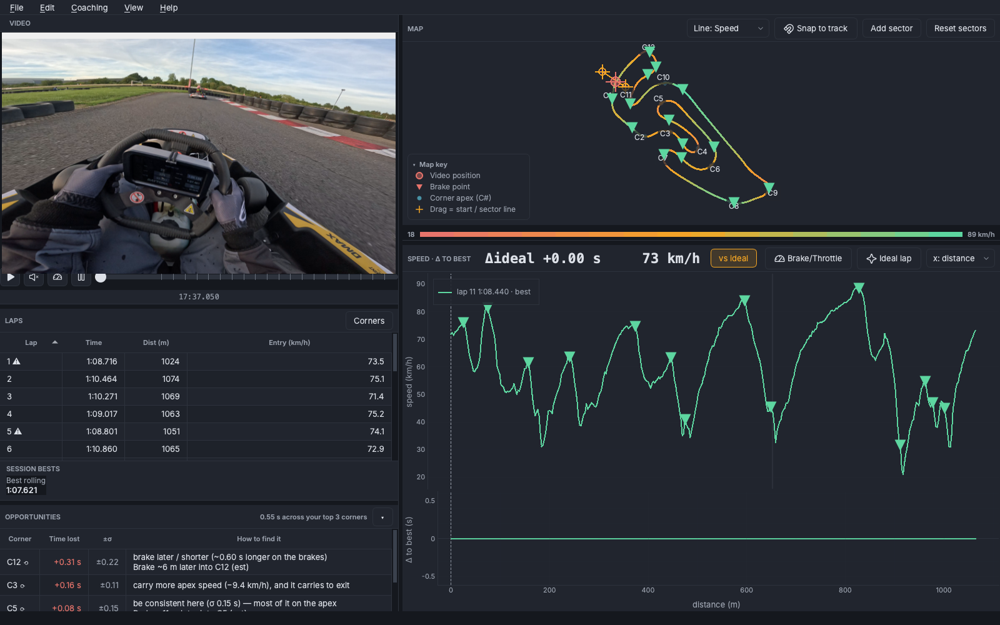
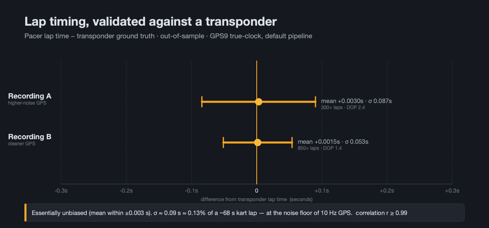
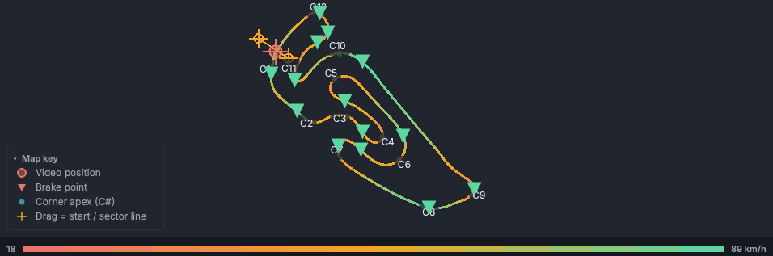
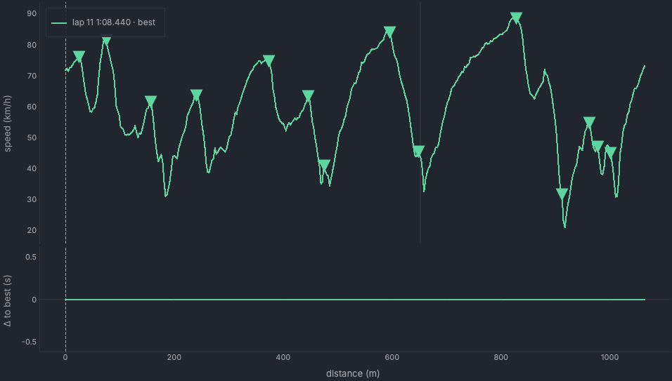
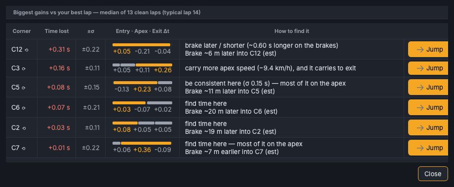

# Pacer

**Transponder-accurate race telemetry from a GoPro you already own — free, 100% local, private.**

Pacer turns a single GoPro recording into a full telemetry workstation — track map, lap-by-lap
deltas, synced video, driving analysis, and a g-meter — from the GPS and motion data the camera
already records. No transponder, no data logger, no cloud, no extra hardware.



> Local desktop app (macOS, Apple Silicon). Open an `.MP4`, get your laps.

## What it is

You already run a GoPro on the kart or car. That footage secretly carries a 10 Hz GPS track and a
200 Hz IMU. Pacer reads it and gives you the analysis a dedicated data logger would — lap and sector
times, a racing line you can pick apart, deltas to your best lap, braking and grip — without buying
or wiring anything. It's a desktop app for sitting down *after* a session and finding where the time
went.

## Accuracy — the moat

Pacer's lap times are **validated out-of-sample against a real transponder**: essentially unbiased
(mean error within **±0.003 s**), with σ ≈ **0.05–0.09 s** — about **0.13%** of a ~68 s kart lap —
and per-lap correlation **r ≥ 0.99**, at the noise floor of 10 Hz GPS. It comes from timing on the
camera's own **GPS true-clock** instead of the video/sample clock that consumer tools use (which
drifts ~0.1%).



**→ [How accurate is Pacer, and how do we know? (docs/ACCURACY.md)](docs/ACCURACY.md)** — the
validated numbers, the measurement method, and the out-of-sample research showing the timing is at
the practical limit for this data.

## Features

- **True-clock lap & sector timing** — on a **GPS9 camera (Hero 9 and newer)**, lap and sector times
  come from the GPS9 stream on the camera's own clock, transponder-validated (above). Older GPS5
  cameras (Hero 5–7) carry no per-sample clock, so Pacer falls back to the video clock and flags the
  times as estimates.
- **Track map** — the racing line coloured by **speed, Δ-to-best, grip, or elevation**, with brake
  points and draggable start/sector lines you can re-position to re-segment the session.



- **Δ-to-best charts** — speed and cumulative time delta against your best lap, distance-aligned so
  corners line up.



- **Sortable lap table** — every lap and its sector splits, sortable, with the session best
  highlighted.
- **Synced GoPro video** — scrub the lap and the footage follows; play two laps **side by side**,
  including the best lap of *another* recording of the same track ("race a friend's GoPro file").
- **G-meter** — a live accelerometer overlay driven by the camera's IMU.
- **Driving channels** — brake events, coasting, and per-corner grip utilization derived from the
  validated vehicle-frame g and cross-checked against the GPS speed derivative.
- **Coaching** — where you're losing time to your best lap, corner by corner.



- **Shareable lap card** — a clean image summary of a lap to post or send.
- **Video-overlay export** — burn the telemetry overlay onto the footage (via ffmpeg) for sharing.
- **Session library** — a local index of everything you've analysed.

## How it's built

One desktop app on top of a small, fast C++ core — chosen so the whole thing stays legible and
correct rather than clever.

- **A small, fast C++23 core** (`pacer/`) does the load-bearing work: GPMF ingest, geometry,
  lap/sector segmentation, and **GPS9 true-clock timing**. It's a **clean-room, independently
  authored** implementation (see [Acknowledgements](#acknowledgements)).
- **Exposed to Python via nanobind** — the core's types are bound (`bindings/`, litgen-generated)
  and consumed by the app, so there's a single-language surface for the UI.
- **A PySide6 + pyqtgraph desktop UI** (`studio/`) — pure Python on top of the core, doing the
  draggable map handles and frame-accurate video↔telemetry sync natively.
- **A golden-equivalence test gate.** Every core-math refactor is proven **byte-identical**
  (`max|Δ| = 0`) against a dense fingerprint of a real recording's whole analysis API before it
  lands — and CI runs the same machinery over a deterministic synthetic session. Correctness is a
  gate, not a hope.

Depth: **[AGENTS.md](AGENTS.md)** (the authoritative developer reference — build/test/lint,
architecture, and the golden gate) and **[studio/README.md](studio/README.md)** (the module map).

## Built with LLM coding agents

Pacer is developed solo, with the implementation handed to LLM coding agents under a strict
discipline: every change is one focused pull request, gated by the golden-equivalence check
(`max|Δ| = 0` on real footage) and the full ctest suite before it merges. The rigor above — the
transponder validation, the byte-identical core-math gate, the out-of-sample research — is what makes
that workflow safe. It's a deliberate engineering methodology, not a novelty: the guardrails do the
trusting so the agents can do the typing.

## Non-goals

Stating what Pacer deliberately *isn't* is part of the design:

- **Not a mobile app.** It's an offline **desktop deep-analysis** tool, for sitting down with a
  session after the fact.
- **Not a live / in-car system.** No real-time HUD, no OBD-II or CAN, no in-session telemetry —
  Pacer reads recorded GoPro footage.
- **macOS Apple Silicon only, today.** The build and app target arm64 macOS.

## Get Pacer

**A Mac (Apple Silicon) and a GoPro is all you need.** Today Pacer installs **from source** — one
command with [pixi](https://pixi.sh), no manual toolchain setup. A prebuilt, double-clickable
`Pacer Studio.app` (`.dmg`) is planned but **not yet published** to
[Releases](https://github.com/eenndan/pacer/releases) — the packaging is done and CI-checked
(`docs/PACKAGING.md`), it just needs a signed build uploaded.

1. **Build & launch** — `pixi run studio -- /path/to/GX010060.MP4` (see
   [Build from source](#build-from-source); the first run resolves the environment automatically).
2. **Open a GoPro `.MP4`** — drag it onto the window, or `File ▸ Open`.
3. **Read your first lap** — the [**First lap walkthrough**](docs/FIRST_LAP.md) shows you the
   30-second path from footage to "where am I losing time?"

> On a track Pacer doesn't know yet, it places a sensible start/finish line for you and flags the
> timing as *provisional* — drag the line on the map to where a lap begins and it's remembered for
> that recording. See the walkthrough.

## Build from source

*For developers, or to produce your own `.dmg`.* [pixi](https://pixi.sh) manages all external
dependencies (`cmake`, `ninja`, `catch2`, **`ffmpeg`** for video export). Build tooling is
`cmake` + `litgen` (binding codegen) glued via `scikit-build-core`.

```bash
git submodule update --init --recursive   # 3rdparty deps (gpmf-parser, nanobind)
pixi install                              # environment + editable Python bindings
pixi run studio -- /path/to/GX010060.MP4  # build + launch on a recording
```

GoPro chapter siblings (`GX01…`, `GX02…`) are chained automatically.

To explore without your own footage, `pixi run studio -- --demo` fetches a real demo lapping
recording at runtime (nothing large is committed). *(The demo clip isn't uploaded to the release
yet, so `--demo` currently falls back to the empty welcome screen — see
[docs/PACKAGING.md](docs/PACKAGING.md#demo-data).)*

## Install / Packaging

To build a standalone, double-clickable **`Pacer Studio.app`** + a drag-to-install `.dmg` (no
pixi / Python needed on the target Mac), see **[docs/PACKAGING.md](docs/PACKAGING.md)** —
`packaging/build_macos.sh` produces an unsigned app via PyInstaller; that doc also covers the
codesign + notarize + staple steps for distribution.

## Development

**[AGENTS.md](AGENTS.md)** is the authoritative developer reference — the full build / test / lint
workflow, the architecture and studio module maps, the conventions, and the core-math golden gate.
Start there for any code change.

## Acknowledgements

Pacer began as a fork of [dendi239/pacer](https://github.com/dendi239/pacer) by
Denys Smirnov, whose original C++ core seeded the project. It has since been
substantially rewritten as a clean-room, independent implementation and is now developed
independently. Thanks to Denys for the foundation.

GPS/IMU parsing uses GoPro's [gpmf-parser](https://github.com/gopro/gpmf-parser).

## License

Pacer © 2025-2026 eenndan, licensed under
[CC BY-NC-SA 4.0](https://creativecommons.org/licenses/by-nc-sa/4.0/) — see
[LICENSE](LICENSE). NonCommercial use only; derivatives must be shared alike.

This applies to Pacer's own code. Bundled and linked third-party components (GoPro gpmf-parser,
nanobind, Qt/PySide6, FFmpeg, …) keep their own licenses — see
[THIRD_PARTY_NOTICES.md](THIRD_PARTY_NOTICES.md), which a redistributed app must carry.
