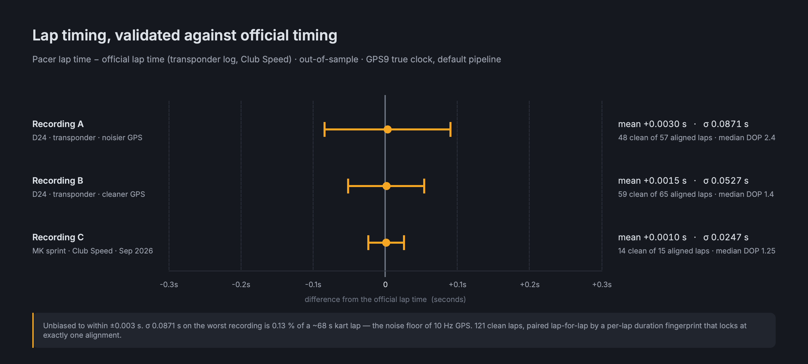
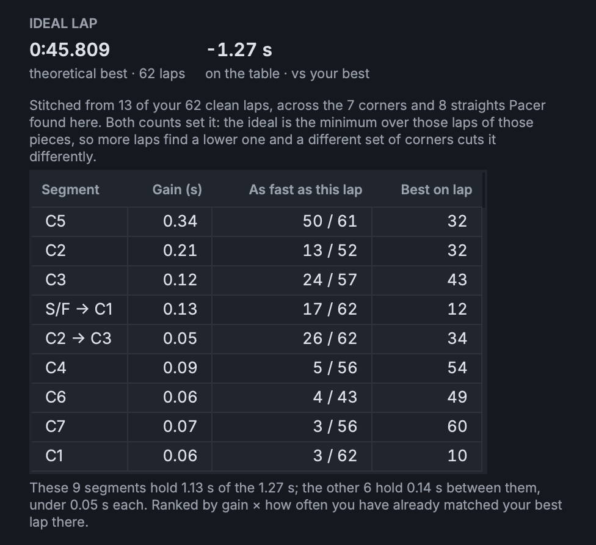
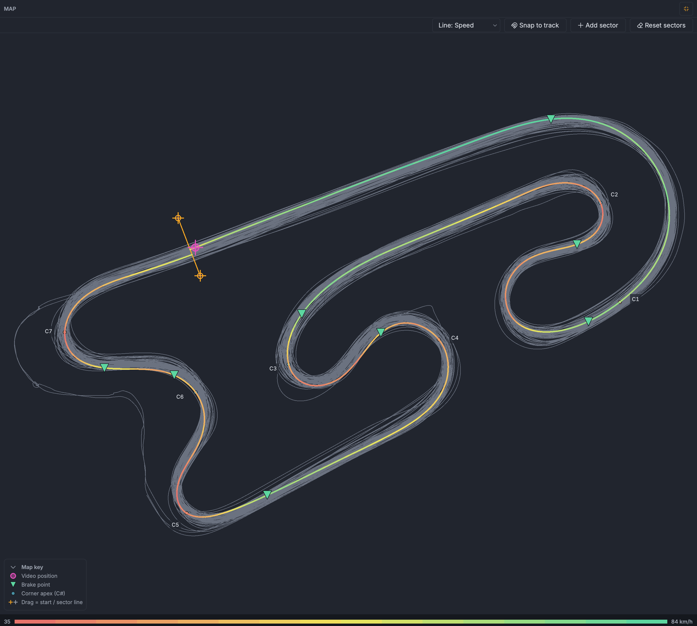
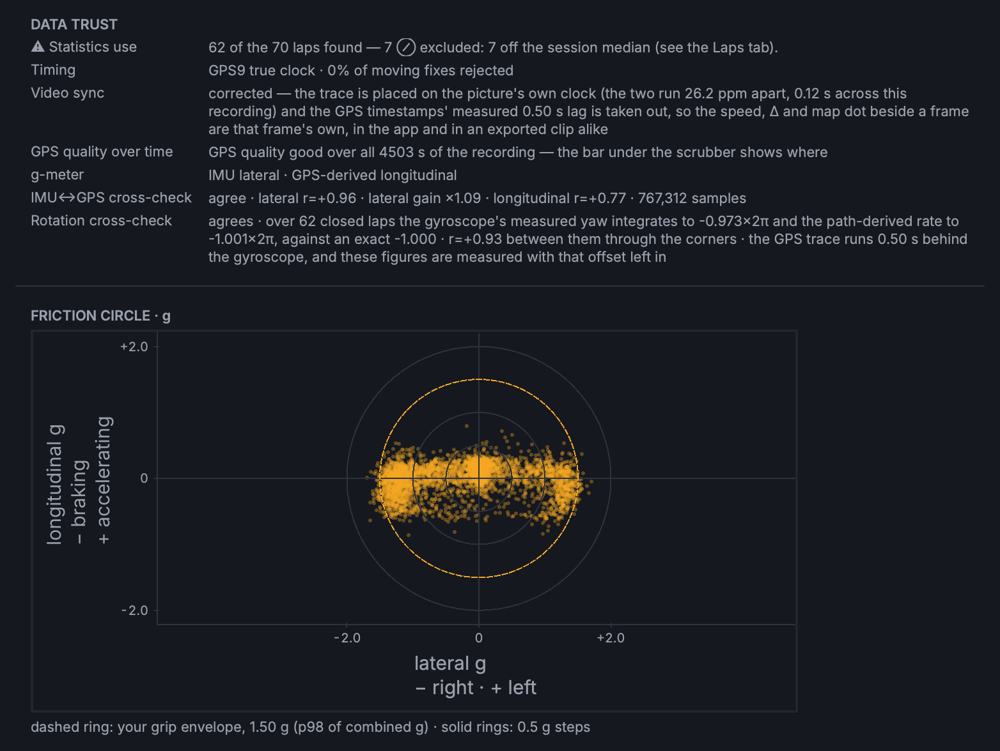
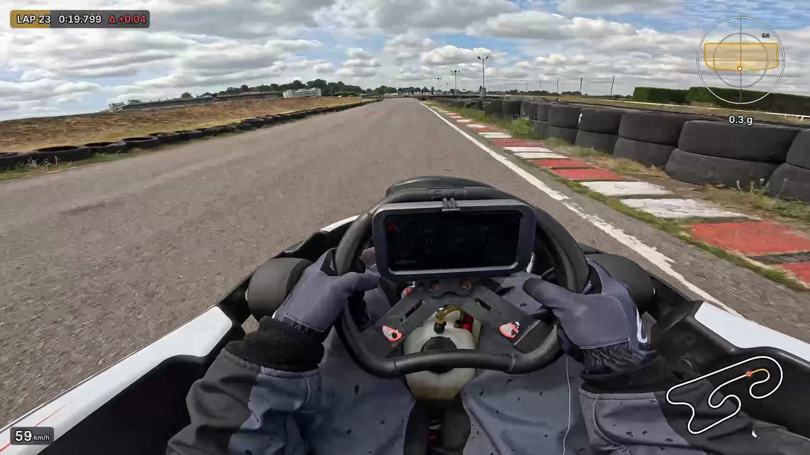

# Pacer

**A macOS race-telemetry workstation built from a single GoPro file, with its lap timing validated
against a real transponder — and the engineering case study behind it.**

Open a GoPro `.MP4`. Pacer reads the 10 Hz GPS and 200 Hz IMU the camera already recorded and gives
you what a dedicated data logger would: lap and sector times, the racing line, an **ideal lap**
stitched from your own best segments, and a ranked list of the corners where you give the most
away. No transponder, no logger, no cloud, no extra hardware.

It is a real, working app — and it is a **portfolio piece**, so this page is written as a case
study: what it claims, how each claim was measured, and the gates that keep it true. **Source is
the only distribution** — no download, no `.dmg`, no signed build (see [Non-goals](#non-goals)).
Building it is one command; reading it is the other intended use.


---

## Accuracy — the claim everything else rests on

Pacer's lap times are validated **out-of-sample against a real transponder**, the ground truth a
race series scores a session with. Over **107 clean laps** across two recordings:

- essentially **unbiased** — mean error within **±0.003 s**;
- **σ 0.0527 s** on the cleaner-GPS recording, **0.0871 s** on the noisier one — about **0.13 %** of
  a ~68 s kart lap, quoting the worse of the two on purpose;
- 48 clean laps of 57 aligned, and 59 of 65. A modest sample, and the honest one.



No lap is hand-matched: the session's per-lap *duration* sequence is correlated against every
candidate window of the transponder log. Because the winning offset is *chosen* to maximise `r`,
that `r` is not an accuracy statistic — the **margin** is. The fingerprint matches at **r ≥ 0.99 at
exactly one offset and below 0.29 at every other**. The session Pacer timed is provably the session
the transponder timed.

Why it works: timing runs on the camera's own **GPS9 true clock**, not the video/sample clock that
consumer tools use, which drifts on the order of 0.1 % — enough to quietly bias every lap in a
session. Where the remaining error comes from, and the sensor fusion, Kalman/RTS smoothing,
Doppler-aided positioning and map-matching that were tried and **rejected on evidence**, are in
**[docs/ACCURACY.md](docs/ACCURACY.md)**.

---

## What it does

**Lap and sector timing you can audit.** True-clock timing on a GPS9 camera (Hero 9 and newer).
Older GPS5 cameras (Hero 5–7) carry no per-sample clock, so Pacer falls back to the video clock and
marks every time `(est)`. On an unknown track it fits a start/finish line for you, calls the timing
*provisional*, and demotes what depends on it until you drag the line into place — `⌘Z` undoes.

**An ideal lap that states its own sample.** The target is a composite of your own fastest corners
and straights, and the Stats page shows the decomposition: what each segment gives away, how many
of your clean laps have already matched it, and which lap set the mark. The gain column sums to the
headline. It is an *order statistic*, so it falls as a session gets longer — the app says how many
laps it was minimised over rather than letting you read it as a floor.



**A racing line that is a data channel.** Colour it by speed, Δ to best, grip or elevation. Brake
points, corner apexes and draggable start/sector lines sit on it, and every mark is named in the
key — drag a line and the session re-segments.



**Charts, video, and the gap between two laps.** Speed and cumulative Δ to ideal, distance-aligned
so corners line up. Scrub the chart and the footage follows; play two laps side by side — including
the best lap of *another* recording of the same track. A g-meter and the brake / coast / grip
channels ride along.

**Coaching.** A ranked shortlist of the corners where your *typical* lap gives away the most to
your *best* one, each with a dominant reason chosen from four measured signals — apex speed,
braking, coasting, line — and a button that jumps the video to your best lap through that corner.
No model, no ML: every number is a reduction of a validated channel.

**Session statistics.** A full page — PACE, IDEAL LAP, SECTORS, CORNERS, BRAKING, STRAIGHTS,
DRIVING, SPEED · G and **DATA TRUST**, which states what the timing was derived from, how many
fixes were rejected, and the IMU↔GPS cross-check with its **gain** (correlation alone cannot catch
a mis-scaled channel).



**Exports.** Lap times and per-lap channels as CSV, a session report as HTML, a shareable lap card
as an image, and the telemetry burned onto the footage as an MP4 (via ffmpeg).



**And the window is yours.** Four resizable panels with a tabbed lap panel (Laps · Corners · Stats ·
Coaching, digits `1`–`4`), a maximize button on every panel header, `⌘⌃F` for full screen,
km/h ↔ mph, colour-blind-safe cues, a local session library, and privacy controls under
`Help ▸ Your data & privacy`.

What shipped when is in **[CHANGELOG.md](CHANGELOG.md)**.

---

## How it's built

One desktop app on a small C++ core, with the correctness moved out of code review and into gates.

- **A 1,873-line C++23 core** (`pacer/`) does the load-bearing work: GPMF ingest, geometry,
  lap/sector segmentation, and GPS9 true-clock timing. It is a clean-room, independently authored
  implementation (see [Acknowledgements](#acknowledgements)).
- **Bindings that cannot drift.** The nanobind glue and stubs are litgen-generated, and CI runs
  `git diff --exit-code -- bindings/` after the build: a header edit that isn't regenerated and
  committed fails the pipeline.
- **A golden fingerprint at eps 0.** Every core-math change is compared leaf-by-leaf against a dense
  fingerprint of a real recording's *whole* analysis API — 120k+ float leaves, `max|Δ| = 0`, no
  tolerance. The same machinery runs in CI over a deterministic synthetic session, so the gate never
  sleeps on a machine without the footage.
- **Design guards that fail the build.** Every spacing, radius and control height in the stylesheet
  must be a declared token (`tests/test_design_system.py`); no module may hand-pick a layout
  dimension or an inline style; every user-visible glyph must render in the app's own face rather
  than an OS fallback; and colour is checked for WCAG AA contrast plus a colour-blind ramp measured
  against a deuteranopia simulation.
- **A QA harness that drives the real app.** `studio/dev/ui_capture.py` builds the real
  `StudioWindow` offscreen on real footage, so a UI finding arrives as a measurement rather than an
  opinion — *"in a 447 px quadrant these 8 columns wanted 501 px, so `Grip (est)` started at x=422
  and 0 of 12 grip cells rendered a readable value"* is the comment above the fix. A companion
  guard proves the app never writes into its own source tree, from a tripwire on every write path
  Python and Qt expose.
- **87 CTest registrations** — Catch2 over the C++ core, plus offscreen Qt suites that build real
  widgets and measure them. The whole thing runs in about five minutes; `pixi run golden`, the gate
  you actually run after every maths change, takes half a second. CI runs all of it plus an
  end-to-end offscreen smoke on every pull request.

Depth: **[AGENTS.md](AGENTS.md)** (the authoritative developer reference) and
**[studio/README.md](studio/README.md)** (the module map).

## Honesty as a design rule

The hard part of a tool like this is not computing a number, it is refusing to present one better
than it is. So that is a rule with an owner in the code:

- **one canonical `(est)`.** `theme.ESTIMATED_MARK` is the only place the wording lives, so the app
  cannot end up spelling it four ways — `(est)` here, `(EST)` there, `ESTIMATED` and `(est.)`
  elsewhere.
- **provisional timing demotes what depends on it** — an auto-fitted start line means no
  personal-best celebration and a lap table that says why.
- **the shareable outputs are gated.** The lap card and the overlay MP4 read the same trust verdict
  the UI does; the card refuses on provisional timing and the video warns before it burns a number
  into a file someone else will see.
- **the ideal lap discloses its sample**, because a sum of per-segment minima falls the longer you
  stay out. Same driving, same recording: 67.957 s over 5 laps, 66.563 s over 65.
- **DATA TRUST** puts the accuracy story inside the product, not only on this page.

## Built with LLM coding agents

Pacer is developed solo, with the implementation handed to LLM coding agents under a strict
discipline: one focused pull request per change, gated by the golden-equivalence check on real
footage and the full suite before it merges. The rigour above is what makes that workflow safe —
the guardrails do the trusting so the agents can do the typing. 195 merged pull requests went into
the v0.2.0 cycle alone.

## Non-goals

Stating what Pacer deliberately *isn't* is part of the design.

- **Source is the only distribution.** No signed build, no notarization, no `.dmg`, no App Store, no
  Homebrew. `packaging/` can build an unsigned `.app` locally ([docs/PACKAGING.md](docs/PACKAGING.md))
  and CI build-verifies the bundle on every release tag, but nothing is published and nothing is
  planned to be.
- **macOS Apple Silicon only.** No Windows, no Linux.
- **Not a mobile app** — an offline desktop deep-analysis tool, for sitting down with a session
  afterwards.
- **Not a live or in-car system.** No real-time HUD, no OBD-II or CAN. Pacer reads recorded footage.

## Run it from source

A Mac (Apple Silicon) and a GoPro recording. [pixi](https://pixi.sh) manages every external
dependency — `cmake`, `ninja`, `catch2`, and `ffmpeg` for video export — so there is no manual
toolchain setup.

```bash
git submodule update --init --recursive     # 3rdparty deps (gpmf-parser, nanobind)
pixi install                                # environment + editable Python bindings
pixi run studio -- /path/to/GX010062.MP4    # build + launch on a recording
```

Then drag any `.MP4` onto the window, or `File ▸ Open`. Chapter siblings (`GX01…`, `GX02…`) are
chained on request via `--full` or `File ▸ Load full recording`. The
**[first-lap walkthrough](docs/FIRST_LAP.md)** is the 30-second path from footage to "where am I
losing time?"; for a code change, start at [AGENTS.md](AGENTS.md).

## Acknowledgements

Pacer began as a fork of [dendi239/pacer](https://github.com/dendi239/pacer) by
Denys Smirnov, whose original C++ core seeded the project. It has since been substantially
rewritten as a clean-room, independent implementation and is now developed independently. Thanks to
Denys for the foundation.

GPS/IMU parsing uses GoPro's [gpmf-parser](https://github.com/gopro/gpmf-parser).

## License

Pacer © 2025-2026 eenndan, licensed under
[CC BY-NC-SA 4.0](https://creativecommons.org/licenses/by-nc-sa/4.0/) — see
[LICENSE](LICENSE). NonCommercial use only; derivatives must be shared alike.

This applies to Pacer's own code. Bundled and linked third-party components (GoPro gpmf-parser,
nanobind, Qt/PySide6, FFmpeg, …) keep their own licenses — see
[THIRD_PARTY_NOTICES.md](THIRD_PARTY_NOTICES.md), which a redistributed app must carry.
