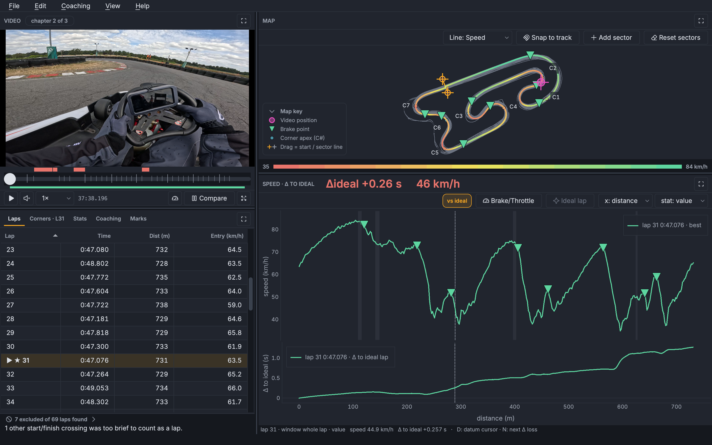
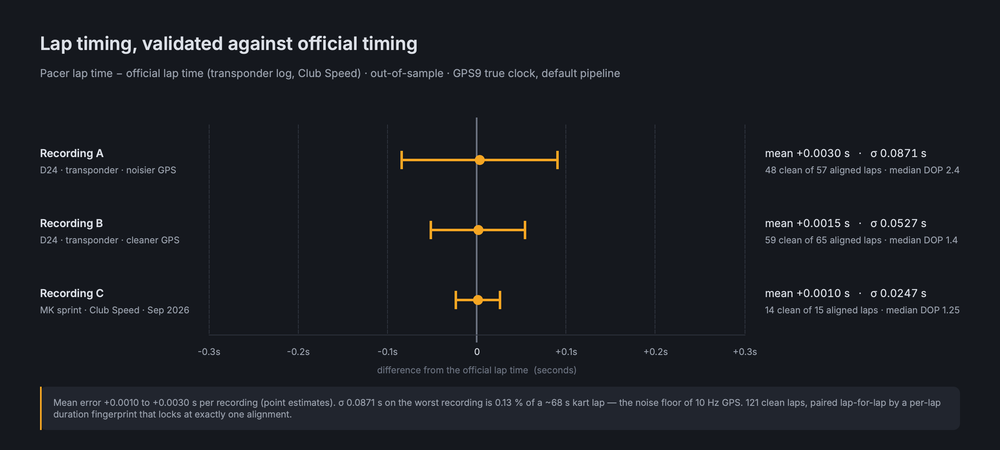
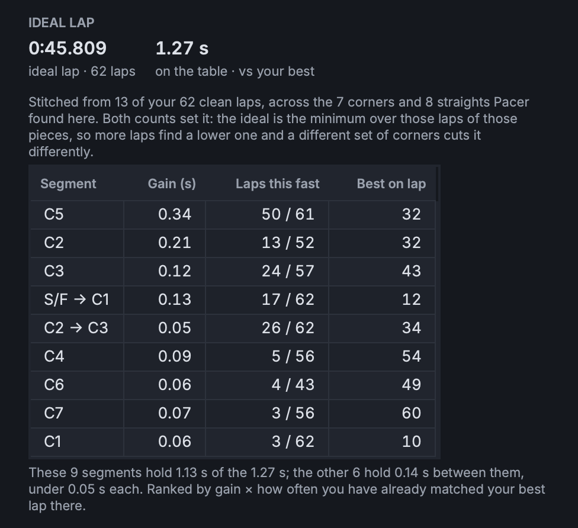
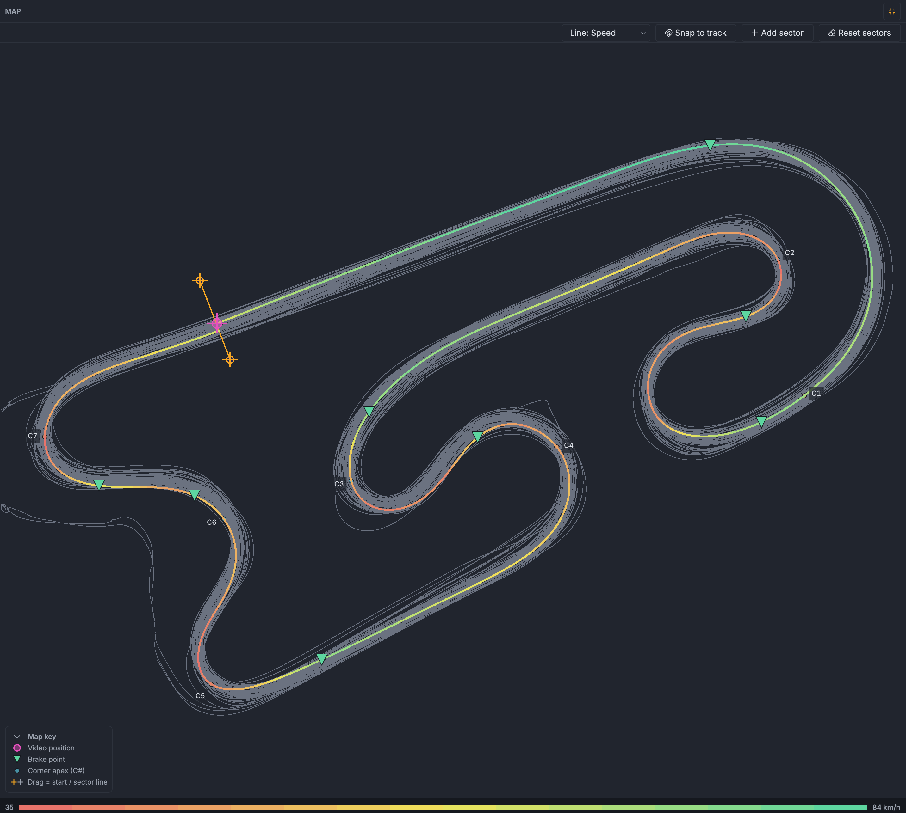
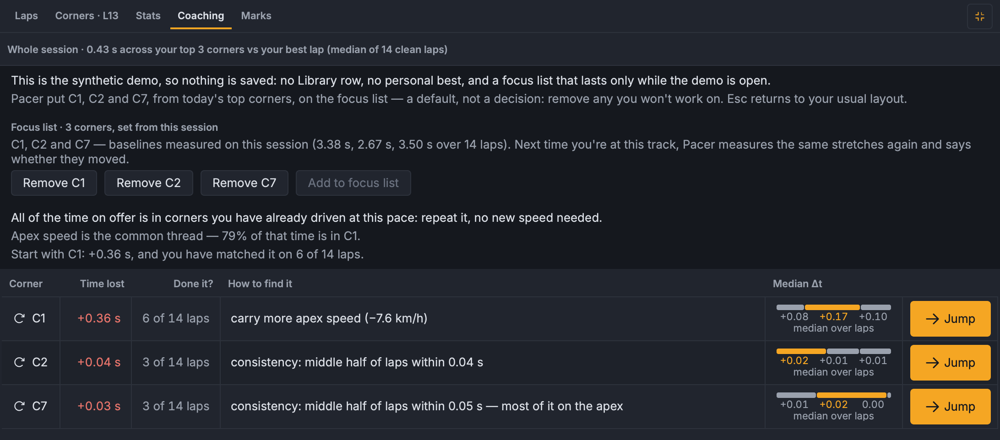
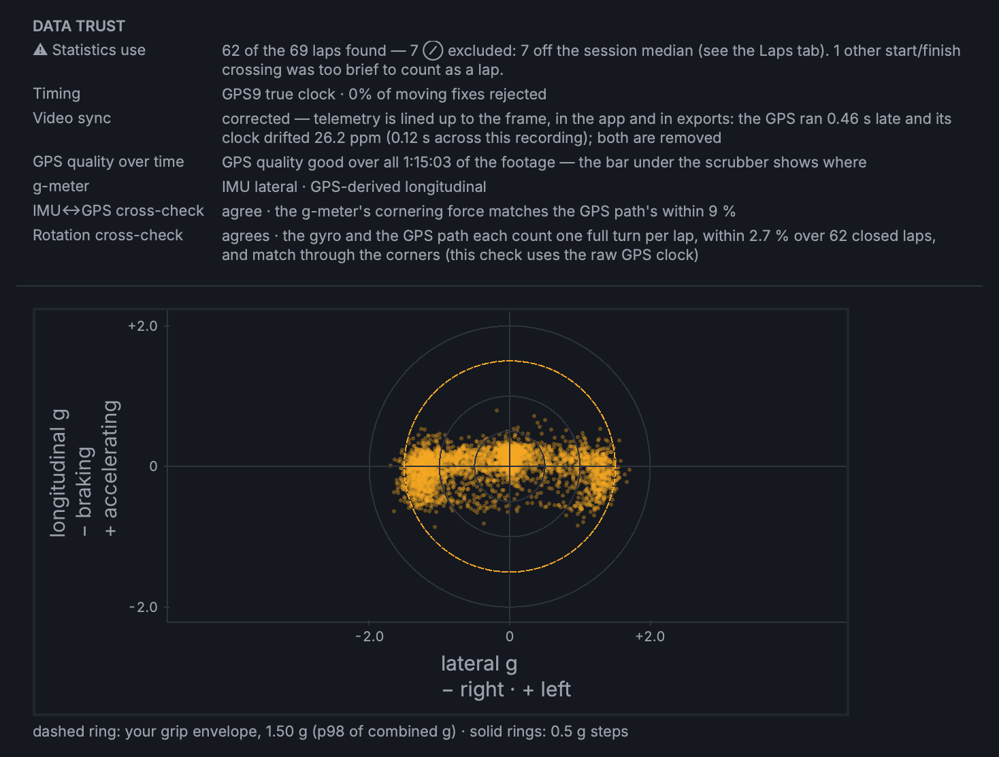
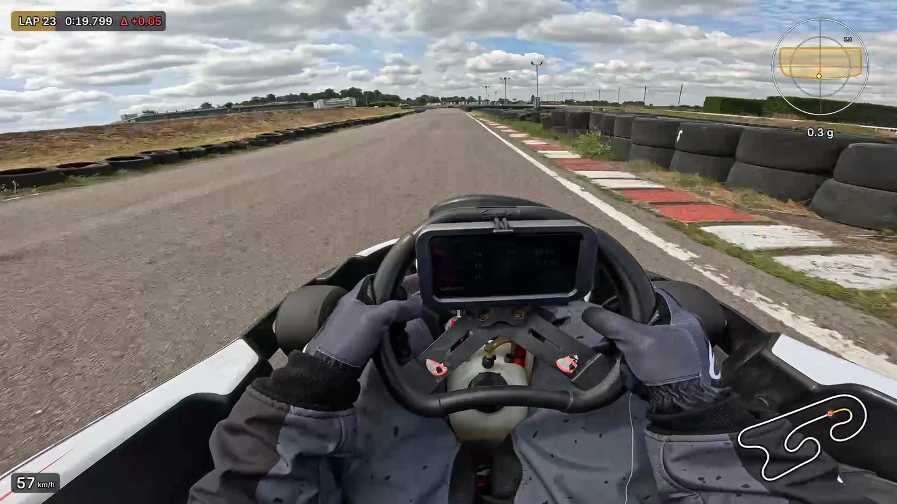

# Pacer

*The case study as a web page: [eenndan.github.io/pacer](https://eenndan.github.io/pacer/) · how
it was built, in eight measured stories: [docs/ENGINEERING.md](docs/ENGINEERING.md)*

**A macOS race-telemetry workstation built from a single GoPro file, whose lap times match official
timing to σ 0.025 s over 14 laps at one circuit, re-measured by a real-footage check — and the
engineering case study behind it.**

Open a GoPro `.MP4`. Pacer reads the 10 Hz GPS and 200 Hz IMU the camera already recorded and gives
you lap and sector times, the racing line, an **ideal lap** stitched from your own best segments,
and a ranked list of the corners where you give the most away. No transponder, no logger, no
cloud, no extra hardware.

It is a real, working app — and it is a **portfolio piece**, so this page is written as a case
study: what it claims, how each claim was measured, and the gates that keep it true. **Source is
the only distribution** — no download, no `.dmg`, no signed build (see [Non-goals](#non-goals)).



*Every screenshot here is Pacer on Sandown 3h — three hours at Sandown Park — but the
debrief, which is the synthetic demo's; all are captured by one command,
[`studio/dev/media_capture.py`](studio/dev/media_capture.py). In motion:
[20 seconds of the best lap as the app exports it](docs/media/best-lap.mp4).*

**Try it** on an Apple Silicon Mac with [pixi](https://pixi.sh) — the demo needs no GoPro:

```bash
git clone --recursive https://github.com/eenndan/pacer && cd pacer
pixi install                 # environment + editable Python bindings, about 2 GB, once
pixi run studio -- --demo    # build + launch on a synthetic session: about 11 MB, downloaded once
```

Your own recording: [Run it from source](#run-it-from-source).

---

## Accuracy — the claim everything else rests on

Pacer's lap times are validated **out-of-sample against official timing** — a race's transponder
log, the ground truth a series scores a session with, and a circuit's published timing sheet. Over
**121 clean laps** across three recordings — a modest sample, and the honest one:

- mean error **+0.0010 to +0.0030 s** per recording — point estimates, not a bound;
- **σ 0.0247 s**, **0.0527 s** and **0.0871 s**.

Two recordings are D24's — the Daytona 24-hour race at Milton Keynes that Pacer was built on —
checked against the race's transponder log and reported as recorded; neither can be re-run from
this repository. The third, a sprint there, is re-measured against the circuit's Club Speed timing
by a real-footage check. The Sandown recordings wait for timing sheets behind a Club Speed sign-in.



No lap is hand-matched: the session's per-lap *duration* sequence is correlated against every
candidate window of the timing. Because the winning window is *chosen* to maximise `r`, that `r` is
not an accuracy statistic — the **margin** is, and
[docs/ACCURACY.md](docs/ACCURACY.md#how-its-measured) tabulates it.

Why it works: a GoPro writes GPS in packets, so a lap timed by spreading a packet's fixes evenly
can read up to ~0.1 s off, with no average bias. GPS9 stamps every fix, and Pacer times on that
**true clock**. The error budget, and the sensor fusion, Kalman/RTS smoothing, Doppler-aided
positioning and map-matching **rejected on evidence**, are in
**[docs/ACCURACY.md](docs/ACCURACY.md)**.

**Verify it yourself:** `pixi run verify` times a synthetic GoPro recording with known truth
through the real loader (noise-free: `max|Δ| 0.41 ms` at a line mid-straight, `0.80 ms` at the
app's own line) and runs the golden gate. It proves the clock, chapter seam and interpolation;
official timing measures the noise floor.

---

## What it does

- **Lap and sector timing you can audit.** True-clock timing needs the GPS9 stream, which GoPro's
  metadata spec lists for a **Hero 11, Hero 13, MAX2 or MISSION 1** (tested on a Hero 13; a spec
  entry is not a tested file); the Hero 12 has no GPS receiver at all and cannot be lap-timed, and
  Hero 5 through Hero 10, the Fusion and the original Max carry GPS5 only, so Pacer times those
  recordings on the video clock and labels it estimated.
- **An ideal lap that states its own sample.** A composite of your own fastest corners and
  straights, and the Stats page shows the decomposition.



- **A racing line that is a data channel.** Colour it by speed, Δ to best, grip or elevation;
  scrub the chart and the footage follows, or play two laps side by side — including the best lap
  of *another* recording of the same track.



- **Coaching, and the loop it is built around.** A ranked shortlist of the corners where your laps
  *typically* give away the most to your *best* one, each with a dominant measured reason; a
  recording's first open, once its timing is trusted, lands on it as a **debrief** and puts its top
  corners on the track's **focus list**, for the next session there to re-measure.



- **Session statistics.** A full page, down to **DATA TRUST**, which states what the timing was
  derived from, how many fixes were rejected, and the IMU↔GPS cross-check with its **gain**
  (correlation alone cannot catch a mis-scaled channel).



- **Exports.** Lap times and per-lap channels as CSV, a session report as HTML, a shareable lap
  card as an image, and the telemetry burned onto the footage (via ffmpeg).



The rest of the window is in the **[first-lap walkthrough](docs/FIRST_LAP.md)**.

What shipped when is in **[CHANGELOG.md](CHANGELOG.md)**.

---

## How it's built

One desktop app on a small C++ core, with the correctness moved out of code review and into gates.

- **A 2,199-line C++23 core** (`pacer/`) does the load-bearing work: GPMF ingest, geometry,
  lap/sector segmentation, and true-clock timing. It is a clean-room, independently authored
  implementation (see [Acknowledgements](#acknowledgements)).
- **Bindings that cannot drift.** The nanobind glue and stubs are litgen-generated, and CI runs
  `git diff --exit-code -- bindings/` after the build: a header edit that isn't regenerated and
  committed fails the pipeline.
- **A golden fingerprint at eps 0.** Every core-math change is compared leaf-by-leaf against a dense
  fingerprint of a real recording's *whole* analysis API, with no tolerance. The same machinery
  runs in CI over a deterministic synthetic session, so the gate never sleeps on a machine without
  the footage.
- **Design guards that fail the build.** Every spacing, radius and control height in the stylesheet
  must be a declared token (`tests/test_design_system.py`); no module may hand-pick a layout
  dimension or an inline style; every user-visible glyph must render in the app's own face rather
  than an OS fallback; and colour is checked for WCAG AA contrast plus a colour-blind ramp measured
  against a deuteranopia simulation.
- **A QA harness that drives the real app.** `studio/dev/ui_capture.py` builds the real
  `StudioWindow` offscreen on real footage, so a UI finding arrives as a measurement rather than an
  opinion. A companion guard proves the app never writes into its own source tree, from a tripwire
  on every write path Python and Qt expose.
- **160+ CTest registrations** — Catch2 over the C++ core, plus offscreen Qt suites that build real
  widgets and measure them. CI runs all of it on every pull request, four tests at a time, plus an
  end-to-end offscreen smoke. It skips what its runner cannot run: the 16+ `footage.*` checks,
  which need a real recording, 4 of the 6 `videotoolbox.*` export checks, which need Apple's H.264
  hardware encoder, and one crash soak that runs on every push to `main` instead. CTest lists each
  by name as *Skipped*. `pixi run golden`, the gate you actually run after every maths change,
  takes seconds, not minutes (8–14 s on the development Mac, measured 27 September 2026).

Depth: **[AGENTS.md](AGENTS.md)** (the authoritative developer reference) and
**[studio/README.md](studio/README.md)** (the module map).

## Honesty as a design rule

The hard part of a tool like this is not computing a number, it is refusing to present one better
than it is. So that is a rule with an owner in the code:

- **one canonical `(est)`.** `theme.ESTIMATED_MARK` is the only place the wording lives, so the app
  cannot end up spelling it four ways — `(est)` here, `(EST)` there, `ESTIMATED` and `(est.)`
  elsewhere.
- **provisional timing demotes what depends on it** — an auto-fitted start line means no
  personal-best celebration and a lap table that says why.
- **the shareable outputs are gated.** The lap card and the overlay MP4 read the same trust verdict
  the UI does; the card refuses on provisional timing and the video warns before it burns a number
  into a file someone else will see.
- **the ideal lap discloses its sample**, because a sum of per-segment minima falls the longer you
  stay out. Same driving, same recording (Sandown 3h, three hours at Sandown Park):
  46.801 s over 5 laps, 45.809 s over 62.
- **DATA TRUST** puts the accuracy story inside the product, not only on this page.
- **a citable marker vocabulary on the way out** — the exports' caveat marks, in
  [docs/ENGINEERING.md](docs/ENGINEERING.md#a-citable-marker-vocabulary-on-the-way-out).

## Built with LLM coding agents

Pacer is developed solo, with the implementation handed to LLM coding agents under a strict
discipline: one focused pull request per change, gated by the golden-equivalence check on real
footage and the full suite before it merges. The rigour above is what makes that workflow safe —
the guardrails do the trusting so the agents can do the typing.

What that looks like in practice, as eight times a measurement overturned the plan, is in
**[docs/ENGINEERING.md](docs/ENGINEERING.md)**. The rules the agents work by are in
[docs/AGENT-PLAYBOOK.md](docs/AGENT-PLAYBOOK.md).

## Built, measured, not shipped

An idea here gets built far enough to measure, and the measurement is allowed to say no.
**[Features measured and refused](studio/docs/refused-2026-09.md)** is the record of every one
that said no, each with the number that killed it, so whoever proposes it next starts from the
evidence. The longer investigations are kept the same way, and listed in
[docs/ENGINEERING.md](docs/ENGINEERING.md).

## Non-goals

Stating what Pacer deliberately *isn't* is part of the design.

- **Source is the only distribution.** No signed build, no notarization, no `.dmg`, no App Store, no
  Homebrew. `packaging/` holds an ungated local `.app` recipe ([docs/PACKAGING.md](docs/PACKAGING.md));
  no CI job builds or launches it, nothing is published and nothing is planned to be.
- **macOS Apple Silicon only.** No Windows, no Linux.
- **Not a mobile app** — an offline desktop deep-analysis tool, for sitting down with a session
  afterwards.
- **Not a live or in-car system.** No real-time HUD, no OBD-II or CAN. Pacer reads recorded footage.

## Run it from source

[pixi](https://pixi.sh) manages every external dependency — `cmake`, `ninja`, `catch2`, and
`ffmpeg` for video export — pinned by its lockfile. The C++ compiler is the one Apple's Xcode
command-line tools provide, the same install that provides `git`.

```bash
pixi run studio -- /path/to/GX010062.MP4    # your own recording, after the clone and install above
```

Cloned without `--recursive`? `git submodule update --init --recursive` fetches `3rdparty/`.

The environment `pixi install` puts on disk is about 2 GB (measured 3 October 2026: from an empty
cache, clone to the demo's debrief took 54 s on a 420 Mbit/s line). The first `pixi run studio`
builds the core and loads Qt for the first time, and says so; later launches start in a second or
two.

A path on the command line loads just that chapter of a recording; `--full` or
`File ▸ Load full recording` chains the rest. The **[first-lap walkthrough](docs/FIRST_LAP.md)** is
the path from footage to "where am I losing time?"; for a code change, start at
[AGENTS.md](AGENTS.md).

The demo is generated, not filmed, on a circuit Pacer ships, so its laps open with verified
timing. `pixi run smoke` needs no download: it builds the real app headless on a bundled sample
clip and ends in `SMOKE OK`. That clip holds no complete lap, so it proves the build and the
load, not the analysis.

## Acknowledgements

Pacer began as a fork of [dendi239/pacer](https://github.com/dendi239/pacer) by
Denys Smirnov, whose original C++ core seeded the project. It has since been substantially
rewritten as a clean-room, independent implementation and is now developed independently. Thanks to
Denys for the foundation.

GPS/IMU parsing uses GoPro's [gpmf-parser](https://github.com/gopro/gpmf-parser).

## License

Pacer © 2025-2026 eenndan, licensed under
[CC BY-NC-SA 4.0](https://creativecommons.org/licenses/by-nc-sa/4.0/) — see
[LICENSE](LICENSE). NonCommercial use only; derivatives must be shared alike.

This applies to Pacer's own code. Bundled and linked third-party components (GoPro gpmf-parser,
nanobind, Qt/PySide6, FFmpeg, …) keep their own licenses — see
[THIRD_PARTY_NOTICES.md](THIRD_PARTY_NOTICES.md), which a redistributed app must carry.
