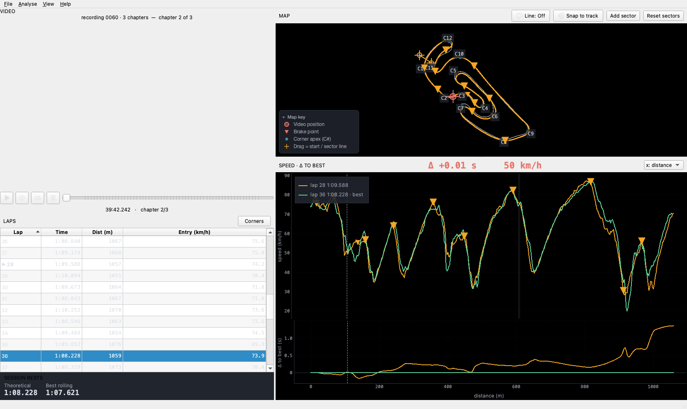

# Read your first lap

A 30-second path from a GoPro recording to *"where am I losing time, and what do I do about it?"* —
the reason Pacer exists.

## 1 · Open a recording

Drag a GoPro `.MP4` onto the window, or **File ▸ Open**. GoPro chapter siblings (`GX01…`, `GX02…`)
are chained automatically. Don't have footage yet? The **Open demo** button on the welcome screen
(or the `--demo` flag) loads a real lapping clip.

Pacer reads the GPS9 + motion data the camera already recorded — no transponder, no extra sensors.

## 2 · Set where a lap begins (only on a new track)

The **first time** you analyse a circuit Pacer doesn't know, it can't know where the start/finish
line is, so it places a **sensible default** (across the main straight) and marks the timing
**provisional** — the lap times show muted/italic and a banner over the map reads *"Lap timing is
unverified."*

**Drag the dashed start/finish line on the map** to where a lap actually begins. The lap times
snap to it, the banner clears, and the placement is **remembered for that recording**. Want it to
auto-detect next time? **File ▸ Save as track…** turns your line into a named track.

*(On the one track Pacer already ships — and any track you've saved — this step is done for you.)*

## 3 · Read the lap

- **Track map** — your racing line coloured by speed, with corners, brake points, and the
  start/sector lines you can drag. A single dropdown switches the colouring: **Speed**, **Δ vs
  best**, or **Grip** (how much of the available grip you used, estimated).
- **Lap table** — every lap and its sector splits, sortable, with your session best highlighted
  (★). The **Entry** column is the corner-entry speed; toggle **View ▸ Units** for mph.
- **Δ-to-ideal / Δ-to-best charts** — the speed trace and the cumulative time delta, distance-
  aligned so corners line up. The live readout leads with **Δ-to-ideal**: how far you are off your
  *theoretical ideal* — the best you've driven at each point on track, stitched together (not a
  single drivable lap) — right where you are on track.

## 4 · See where the time goes (the coaching)

The **Opportunities** panel (always on; full detail under **Coaching ▸ Opportunities…**) ranks
your corners by **time lost vs your best**, each with a **reason** (apex speed, braking, coasting,
or line) and a **±σ** consistency badge — one row telling you *how much* time and *how repeatable*
it is. Braking-point hints ("brake ~6 m later into C3") are labelled **EST** because they're
inferred from the physics, not measured.

## 5 · Race a lap side-by-side

Scrub the lap and the **GoPro video** follows. **Load a reference recording** (**Coaching ▸ Load
reference recording…**) to play your lap **next to** the best lap of *another* recording of the
same track — yours from last month, or a friend's GoPro file.

## 6 · Come back faster

Every session lands in the **Session Library** (**File ▸ Library**), which charts your **personal-
best progression per track** over time. Beat your previous best on a track and Pacer says so.

---

**Trust, honestly labelled.** Timing from a GPS9 camera (Hero 9+) is validated against a real
transponder; older GPS5 cameras fall back to the video clock and are flagged as approximate.
Inferred channels (brake/throttle/grip) and braking-point hints carry an `(est)` / `EST` label.
Provisional (unset start line) timing is muted until you place the line. When in doubt, the number
tells you how much to trust it.

Found a bug or a GoPro model that doesn't parse? **Help ▸ Report a problem…**
