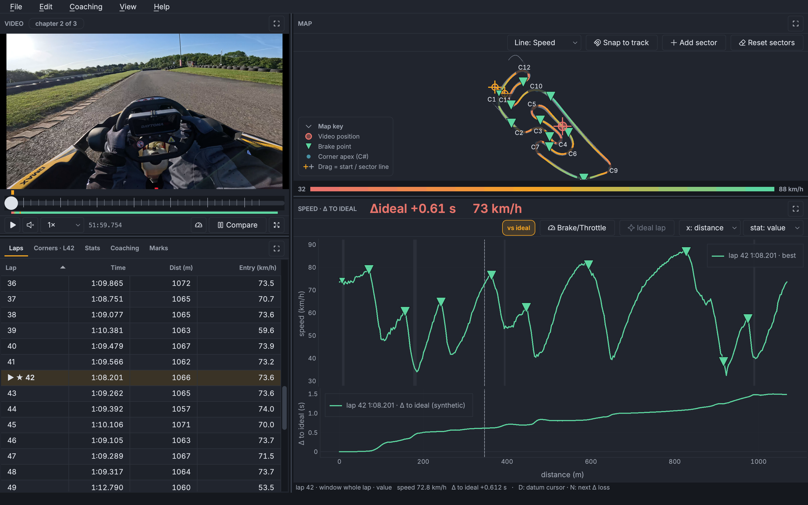

# Read your first lap

A 30-second path from a GoPro recording to *"where am I losing time, and what do I do about it?"* —
the reason Pacer exists.

## 1 · Open a recording

Drag a GoPro `.MP4` onto the window, or **File ▸ Open**.

Pacer reads the GPS9 + motion data the camera already recorded — no transponder, no extra sensors.

**A long recording is split into chapters** (`GX01…`, `GX02…`, same 4-digit recording number), and
Pacer lays them on one timeline. **Dropping** a chapter chains its siblings for you; **File ▸ Open**
deliberately opens exactly the file you picked. Either way, if you end up looking at part of a
recording the window says so — *"1 of 3 chapters — File ▸ Load full recording to analyse the whole
recording"* — and that menu item is live.

> **About the "Open demo" button.** You will only see it if there is a demo clip on your machine to
> open: Pacer looks for `PACER_DEMO_MP4` and then a local cache, and if neither resolves the button
> is not shown at all. **The release asset it would otherwise download has never been published**
> (distribution is a non-goal here), and a button whose only possible outcome is an apology is worse
> than no button — so the welcome screen offers the one door that works: your own footage, opened or
> dropped. To get the button, point `PACER_DEMO_MP4` at a recording you already have. `--demo` on
> the command line still *attempts* the download (with `PACER_DEMO_URL` for a mirror) and says so
> plainly if it can't.

## 2 · Set where a lap begins (only on a new track)

The **first time** you analyse a circuit Pacer doesn't know, it can't know where the start/finish
line is, so it places a **sensible default** (across the main straight) and marks the timing
**provisional** — the lap times show muted/italic and a banner over the map reads *"Lap timing is
unverified — drag the start/finish line on the map to where a lap begins."*

**Drag the dashed start/finish line on the map** to where a lap actually begins. The lap times
snap to it, the banner clears, and the placement is **remembered for that recording**. Want it to
auto-detect next time? **File ▸ Save as track…** turns your line into a named track.

*(On the one track Pacer already ships — and any track you've saved — this step is done for you.)*

## 3 · Read the lap

The window is four panels — video, map, charts, and a tabbed panel under the video. Any panel
maximises to the whole window (the ⛶ button in its header, or double-click the header), and every
divider between them drags.

- **Track map** — your racing line, with corners, brake points, and the start/sector lines you can
  drag. One dropdown switches what the line is coloured *by*: **Off**, **Speed**, **Δ to best**,
  **Grip (est)** (how much of the available grip you used) or **Elevation**. The key names every
  mark on the plot.
- **Speed · Δ to ideal charts** — the speed trace and the cumulative time delta, distance-aligned
  so corners line up. The live readout leads with **Δideal**: how far you are off your *theoretical
  ideal* — the best you've driven at each point on track, stitched together (not a single drivable
  lap) — right where you are on track. Two toggles add a **Brake/Throttle** band under the speed
  curve and overlay the **ideal lap** itself.
- **The tabbed panel**, four full-height pages on the digits **1–4**:
  - **Laps** — every lap and its sector splits, sortable, session best starred (★). The **Entry**
    column is the corner-entry speed; toggle **View ▸ Units** for mph.
  - **Corners** — the same corners, for the *one* lap you have selected: time-in-corner, that
    lap's Δ vs the best lap, apex/entry/exit speeds.
  - **Stats** — session totals, the pace distribution, the g-g friction circle, corner/braking/
    straights reports, the **IDEAL LAP** block and the **DATA TRUST** card. **⌘⇧S** opens it
    full-window.
  - **Coaching** — see below.

## 4 · See where the time goes (the coaching)

The **Coaching** tab (press **4**; the same rows in a resizable window under **Coaching ▸
Opportunities…**) ranks your corners by **time lost vs your best**, taken as the *median* over
your clean laps, each with a **reason** (apex speed, braking, coasting, or line) and a **±σ**
consistency badge — one row telling you *how much* time and *how repeatable* it is. It does not
follow your lap selection; the **Corners** tab is the per-lap view. Braking-point hints
("brake ~6 m later into C3") are labelled **EST** because they're inferred from the physics, not
measured.

Stats ▸ **IDEAL LAP** answers the next question — *how much is actually on the table* — and says
what it was built from: which of your laps donated each corner and straight, how many of your laps
have already been that fast there, and how many laps the whole thing was minimised over. That last
number matters: the ideal is a sum of per-segment minima, so it drops the longer you stay out.

## 5 · Race a lap side-by-side

Scrub the lap and the **GoPro video** follows. **Load a reference recording** (**Coaching ▸ Load
reference recording…**) to play your lap **next to** the best lap of *another* recording of the
same track — yours from last month, or a friend's GoPro file.

## 6 · Come back faster

Every session lands in the **Session Library** (**File ▸ Library…**), which charts your **personal-
best progression per track** over time. Beat your previous best on a track and Pacer says so.

---

**Trust, honestly labelled.** Timing from a GPS9 camera (Hero 9+) is validated against a real
transponder; older GPS5 cameras fall back to the video clock and are flagged as approximate.
Inferred channels (brake/throttle/grip) and braking-point hints carry an `(est)` / `EST` label.
Provisional (unset start line) timing is muted until you place the line. When in doubt, the number
tells you how much to trust it.

Found a bug or a GoPro model that doesn't parse? **Help ▸ Report a problem…**
